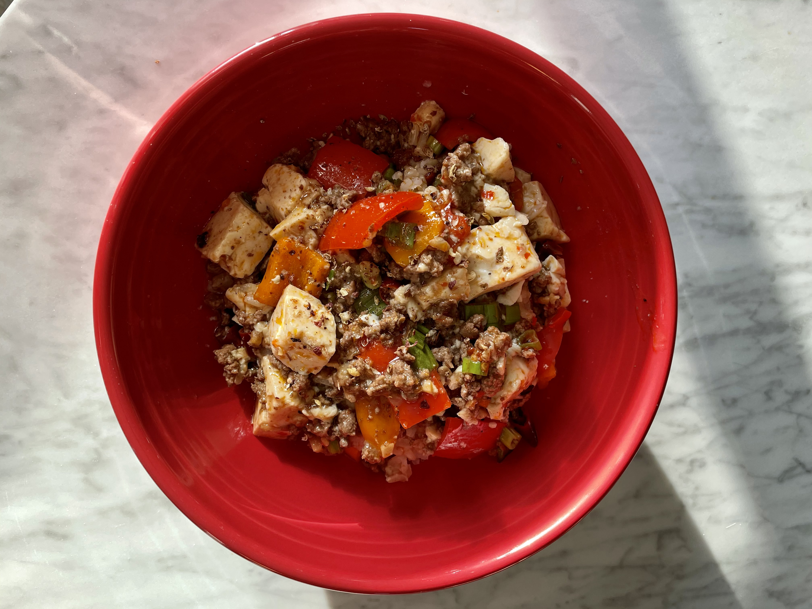

Spicy food lovers, this is for you.

Joey and I came up with this twist on Mapo Tofu over New Year's and for the months following his visits this was always on my grocery list. It's extremely adaptable — easily made plant based, and pretty much any in-season veggies bring new dimension to the dish.

This recipe begins by infusing a fresh chili oil and then quickly builds up a robust, flavorful sauce that will have you laughing and crying and sweating and generally just having a spectacular eating experience. Not for the faint of heart!

## Ingredients

-   5T canola oil
-   10-12 dried Thai chilies
-   1 block silken or soft tofu, drained and cubed
-   1.5T Sichuan peppercorns, crushed/rough ground
-   1T ginger, minced
-   1T garlic, minced
-   0.5lb ground beef or a big handful of minced mushrooms
-   Any veggies you’d like to add… a red bell pepper and a Roma tomato work well (optional)
-   2.5T spicy red bean paste
-   1T fermented black bean paste
-   1T miso (I use shiro/white miso) - optional
-   3/4c stock or water
-   1T corn or potato starch
-   3 green onions, sliced
-   Handful oyster mushrooms, torn up roughly - optional
-   Toasted and/or black sesame seeds (garnish, optional)

## Directions

1. Coat pan thickly in neutral flavored oil (canola). On low heat, toast dried chilies until fragrant, stirring occasionally so they don’t burn.

2. In another pot, bring water to a boil with a pinch of salt. After it boils, turn off the heat and add silk/soft tofu cubes. Let tofu sit in hot water until ready to add to the main pot.

3. Back in the main pan, turn the heat to medium. Add 1-1.5T (depending on grind coarseness) rough ground Sichuan peppercorns and let those sizzle for 30 sec. Add ginger, wait a minute, then add garlic. Fry for another minute.

4. Turn heat to high and add ground beef, breaking it up with a wooden spoon. Cook until brown. Add any optional veggies, like sliced bell pepper or a Roma tomato and cook for a few minutes until they start to tenderize.

5. Add spicy bean sauce. Cook for a minute, then add black bean sauce and miso. Add stock or water and cook for another minute.

6. Turn heat down to medium low. Drain tofu and carefully add to the pot. Stir with the back of your spoon only so as not to break up the tofu.

7. Make a mixture of corn/potato starch and 2.5T cold water. Slowly spoon the slurry into the pot, gaging consistency as you go. The sauce will thicken... at the point it only just starts to cling to the tofu and meat, stop.
